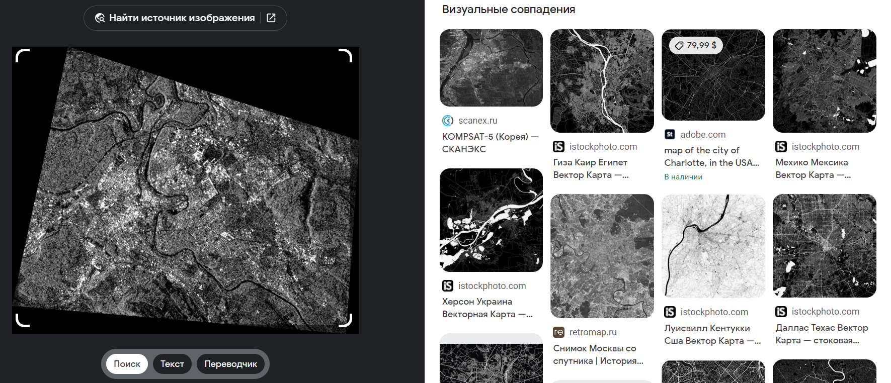

# Что здесь?

Наше хобби — поиск: как навык, как искусство, как образ мыслей.

Мы занимаемся дисциплиной OSINT, которая так или иначе используется во многих сферах нашей жизни.&#x20;

В честь этого названо сообщество: `разведка на основе открытых источников` `как образ мышления`.

Вместе с единомышленниками мы развиваем независимое OSINT-коммьюнити в России.

Что мы делаем:

* [1️⃣ Митапы OSINT mindset: раз в месяц в Москве](https://t.me/osint\_mindset/138)
* [2️⃣](https://t.me/osint\_mindset/138) [Подкасты и интервью про OSINT](http://youtube.com/@osint\_mindset)
* [3️⃣](https://t.me/osint\_mindset/138) [Инструменты для поиска и обработки информации](https://github.com/soxoj)
* [4️⃣](https://t.me/osint\_mindset/138) [Помощь в трудоустройстве в смежных сферах](https://t.me/osint\_mindset/144)
* [5️⃣](https://t.me/osint\_mindset/138) [Форум для обучения OSINT на прикладных задачах](https://t.me/osint\_mindset/150)

Ссылки на полезные и обучающие материалы вы можете найти в меню страницы.

А если хотите принять активное участие — вам [`сюда`](https://docs.google.com/forms/d/e/1FAIpQLScXQhUQ1pF\_-rp6lx-sb9MSBx1e1Qmj60zmkw04Wdls\_m2iEQ/viewform)!
