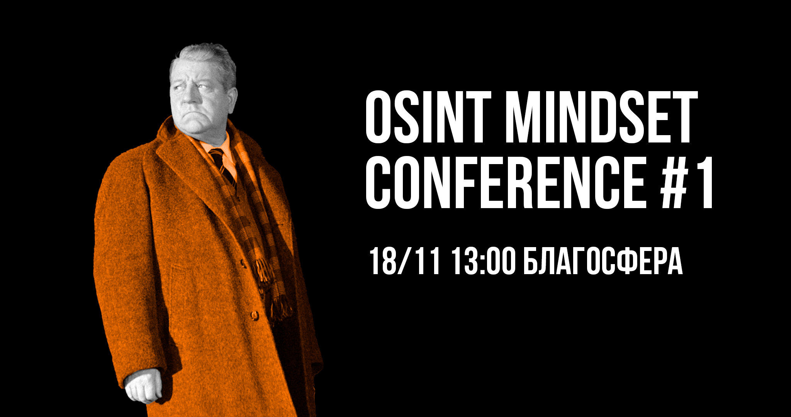

# Конференция #1 | Москва

<figure><figcaption></figcaption></figure>

Грядет OSINT mindset conference #1!&#x20;

На этот раз, у нас для вас 5 докладов двух форматов: short на 15 минут и standard на 45 минут. Помимо докладов, мы подготовили для вас стенды [LockPick](https://t.me/autopsy\_wt) и [OSINT Village](https://t.me/osint\_mindset), где за решение задач самые быстрые и ловкие получат мерч OSINT mindset!

Представляем вам спикеров и темы выступлений: 🔥

[**emisare**](https://t.me/artemov\_security) **— Когнитивные искажения в работе аналитика**

[**R3v3rc3**](https://t.me/in4security) **— Digital Risk Protection: OSINT кейсы из практики**

[**Artyom Semenov**](https://t.me/pwnai) **— Машинное обучение для OSINT. Аналитика данных, инструменты и средства**

[**akoul02**](https://t.me/akoul02) **— Darknet Intelligence: как нырнуть в даркнет и не сойти с ума**

[**mas0yama**](https://t.me/cereshouse) **— Геолоцирование с помощью SMS**

Ждём всех 18 ноября в 13:00 (UTC+3) в [Благосфере](https://blagosfera.ru/kontakty/), Москва, м. Динамо, 1-й Боткинский проезд, д. 7c1.

Мероприятие полностью бесплатное, без регистрации и возрастного ограничения ✨
