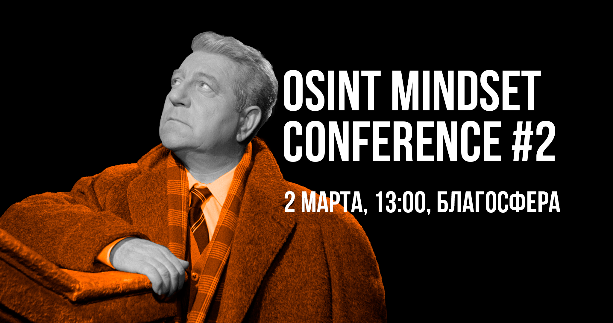

# Конференция #2 | Москва

<figure><figcaption></figcaption></figure>

OSINT mindset conference #2 уже близко! А значит, мы готовы представить наших спикеров: 🔥

[**VKolenickova**](https://t.me/sled\_tut) **— OSINT. Ну, знаете, ради науки**

[**Dukera**](https://t.me/dukera) **— Структурный подход к OSINT**

[**vantip**](https://t.me/vantip) **— Методы поиска информации в молекулярной биологии**

[**Катя Тьюринг**](https://www.youtube.com/@turing\_tears) **— OSINT в коммерческих компаниях**

[**rawrdcore**](https://t.me/rawrdcore) **— Найти нельзя бросить. Поиск координат с точностью 10 метров**

[**váli**](https://t.me/alarm\_vali) **— NoStalk: Counter-OSINT меры**

Помимо докладов мы, как обычно, готовим для вас стенды [LockPick](https://t.me/autopsy\_wt) и [OSINT Village](https://t.me/osint\_mindset), где за решение задач самые быстрые и ловкие получат мерч OSINT mindset! 🔍

Ждём всех 2 марта в 13:00 (UTC+3) в [Благосфере](https://blagosfera.ru/kontakty/) по адресу м. Динамо, 1-й Боткинский проезд, д. 7c1. Расписание и порядок докладов будут опубликованы позже!

Мероприятие полностью бесплатное, без регистрации и возрастного ограничения ✨
