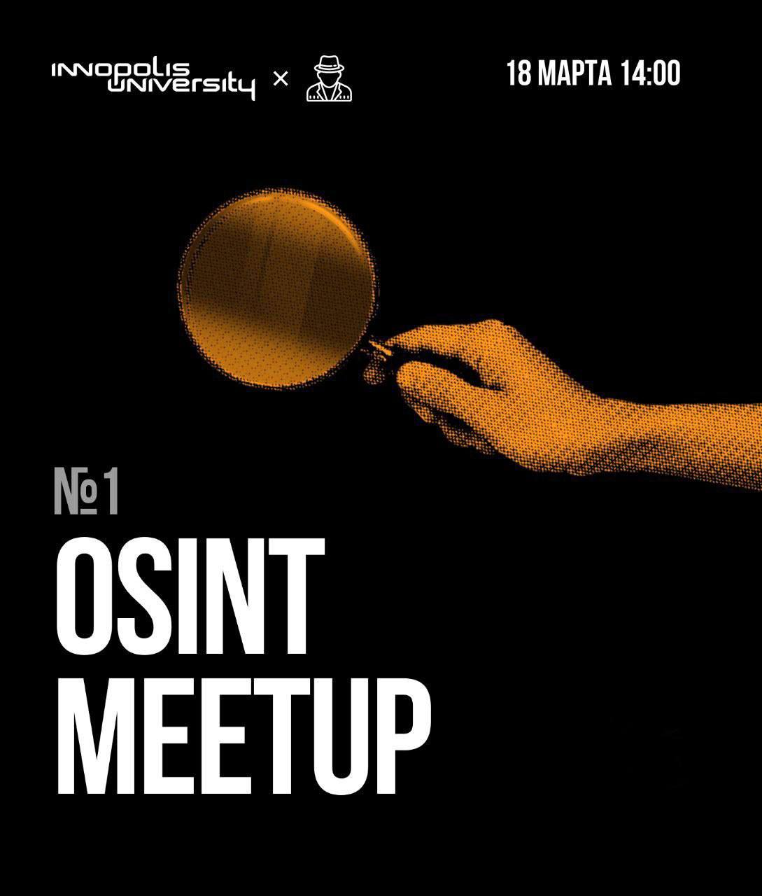

# Митап #1 | Иннополис

<figure><figcaption></figcaption></figure>

Астрологи объявили неделю митапов. 18 марта в университете Иннополис, OSINT Mindset Meetup #1!

Как всегда находить в Сети то, что нужно? Узнать у экспертов, конечно!

OSINT не изучают в университетах, но нужен он практически везде: в бытовых задачах, в корпоративной и кибербезопасности, в любого рода аналитике

🔎 Присоединятесь к нам, раскроем секреты поиска в месте! Темы докладов:&#x20;

* @soxoj, @dukera — "OSINT: введение"&#x20;
* @molberte — "Все что вы хотели знать о владельце домена, но боялись спросить"
* @wdd\_adk — "Новые подходы к OSINT в пентесте и Red Team"&#x20;

❕Для всех гостей университета, не имеющих постоянного доступа к кампусу, необходимо взять с собой паспорт и заполнить вот эту [форму](https://forms.gle/4fxvP8GGHUdXUpLbA) до 17.03 12:00❕

Кстати, если решите написать в форме не реальное имя, а ник, то в кампус вы не попадете.&#x20;

_Персональные данные собираются только для обеспечения вашего доступа в университет и не передаются третьим лицам._
