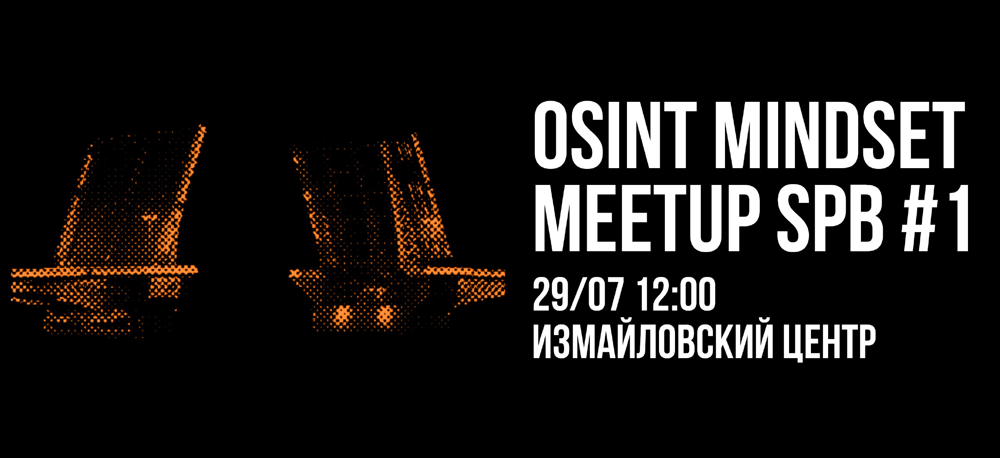

# Митап # 1 | Санкт-Петербург

<figure><figcaption></figcaption></figure>

OSINT Mindset приходит в Петербург! Об OSINT в городе на Неве расскажут: 🔥

* **@adkkkkkkkk — Search Engines: Выбираем "лучшую" поисковую систему**
* [**Dana Scully**](https://t.me/xbshsuwiow83) **— Иголка в стоге сена: практика поиска по сложным проектам**
* **@Solar\_impact\_low — OSINT в расследовании преступлений: реальные кейсы из практики**

Одевайтесь по погоде и приезжайте на митап, будет интересно!

Митап пройдет 29 июля, в 12:00 в Измайловском центре, м. Технологический институт, Измайловский пр., 2 / наб. р. Фонтанки, 120

Мероприятие полностью бесплатное, без регистрации и возрастного ограничения. 🧡
