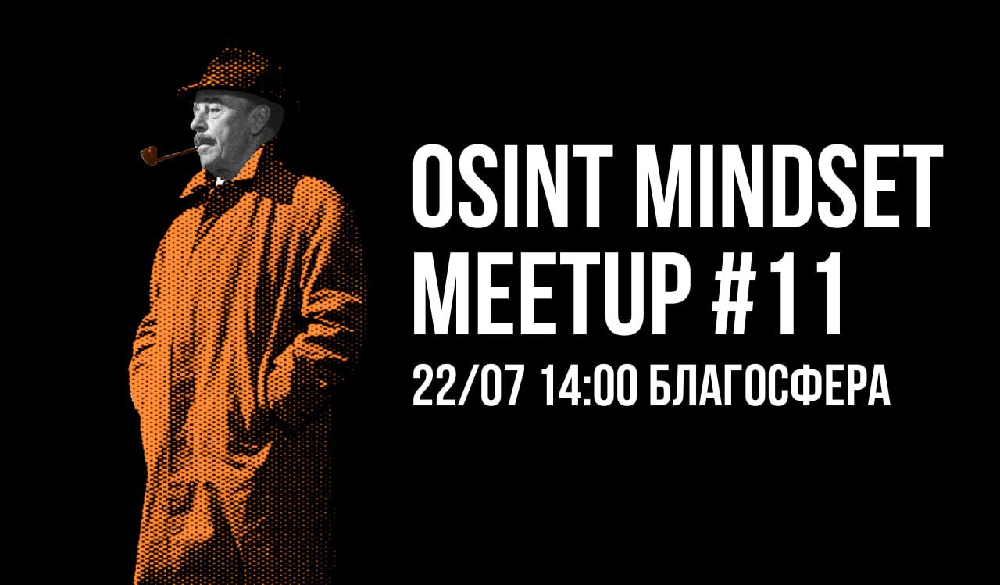

# Митап #11 | Москва

Новый месяц, новый [митап](https://telegra.ph/file/d124dc10f82e813c6c420.jpg)! Коллектив OSINT Mindset вновь предлагает вам приобщиться к загадочному миру искусства цифровой разведки. Вашими проводниками в этом месяце станут:&#x20;

* [Pandora](https://t.me/pandora\_intelligence) — Социальный анализ в расследовании инцидентов ИБ
* @osinterka — Поиск владельцев веб-сайтов
* [Akvagon](https://t.me/LetopisSamogona) — Гадалки и детективы. Зачем заказчики привлекают "магов" к расследованиям?

Берите свои шляпы и раскуривайте трубки, будет интересно!

Митап пройдет 22 июля, в 14:00 в [Благосфере](https://blagosfera.ru/kontakty/), м. Динамо, 1-й Боткинский проезд, д. 7c1.

Для тех, кто будет на своем авто, есть парковка. Пишите @nymaxxx

Мероприятие полностью бесплатное, без регистрации и возрастного ограничения✨
