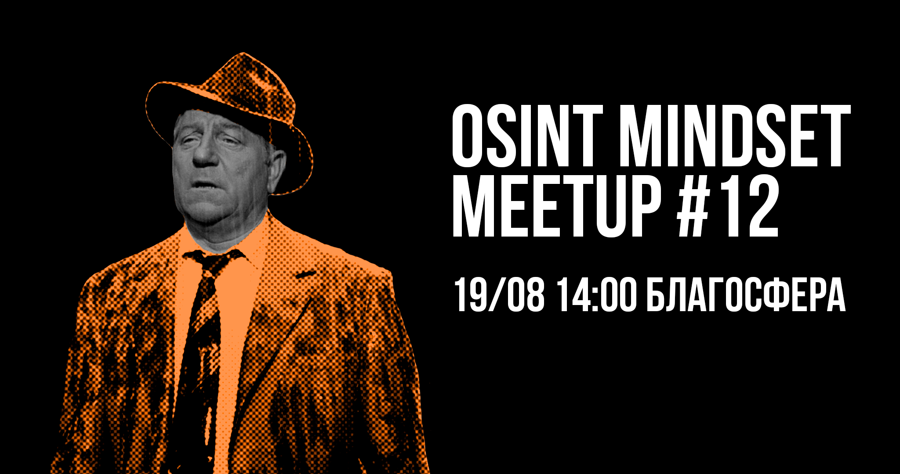

# Митап #12 | Москва

<figure><figcaption></figcaption></figure>

Московские Мегрэ, Шерлоки и Пуаро вновь встретятся в Благосфере. Как обычно, ясным субботним утром, будут обсуждать расследования на [OSINT mindset meetup №12](https://telegra.ph/file/6f9f0dcf1beb0816b93ac.png)! Докладчиками станут:

[VKolenickova](https://t.me/sled\_tut) — На правах бренда: защита домена как цифрового актива

[rawrdcore](https://t.me/rawrdcore) — Способы и инструменты для извлечения информации из VK

[váli](https://t.me/alarm\_vali) — HUMINT в работе осинтера

Митап пройдет 19 августа, в 14:00 в [Благосфере](https://blagosfera.ru/kontakty/), м. Динамо, 1-й Боткинский проезд, д. 7c1. Для тех, кто будет на своем авто, есть парковка. Пишите @nymaxxx

Мероприятие полностью бесплатное, без регистрации и возрастного ограничения✨
