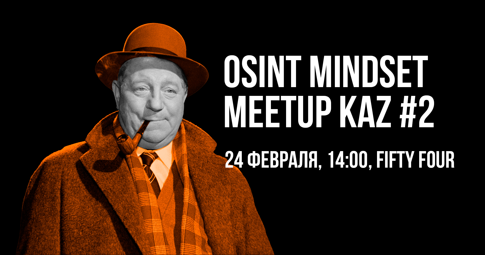

# Митап # 2 | Казахстан

<figure><figcaption></figcaption></figure>

Сәлем, Казақстан! OSINT mindset возвращается к вам с митапом про кибер-расследования в Алмате!

В этот раз докладчиками выступят:

[**Артем Иргебаев a.k.a. Господин Собака**](https://t.me/gspdnsobaka) **— 0xINT: Расследуем криптовалютные транзакции**

[**Анатолий Ремнев a.k.a. Дед Толя**](https://t.me/Remnew) **— Неочевидный OSINT в практике интернет-детектива: примеры и кейсы**

[**Dukera**](https://t.me/dukera) **— GEOINT: методы поиска геолокации в Китае**

Ждём всех желающих 24 февраля, в 14:00 (UTC+6), по адресу Алматы, ул. Маметовой, д. 54, в коворкинге FIFTY FOUR в зале на цокольном этаже. Также планируется трансляция на Youtube!

Мероприятие полностью бесплатное, без регистрации и возрастного ограничения ✨
