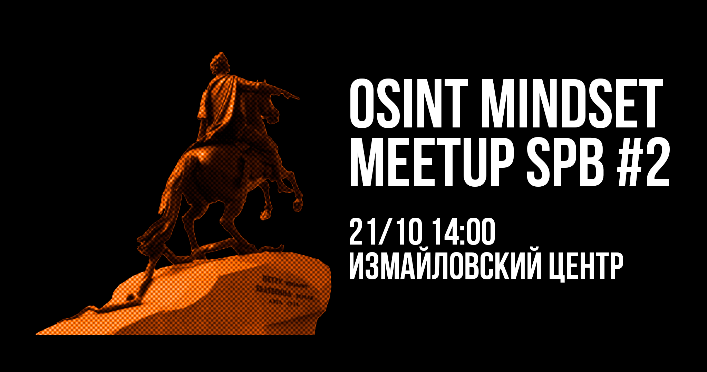

# Митап # 2 | Санкт-Петербург

<figure><figcaption></figcaption></figure>

[OSINT mindset meetup spb #2](https://telegra.ph/file/b818f6c3d564d60191b0d.png) начинает отсчет! Продолжаем знакомить вас с докладчиками культурной столицы 🔥

[The Lie Die](https://t.me/TheLieDie) — Под градом фейков: как фактчекинг помогает сохранять трезвость и вменяемость

[váli](https://t.me/alarm\_vali) — Теория мастер-ключа: доверие в HUMINT

Митап начнется 21 октября, в 14.00 в Измайловском центре, м. Технологический институт, Измайловский пр., 2 / наб. р. Фонтанки, 120

Мероприятие полностью бесплатное, без регистрации и возрастного ограничения ✨
