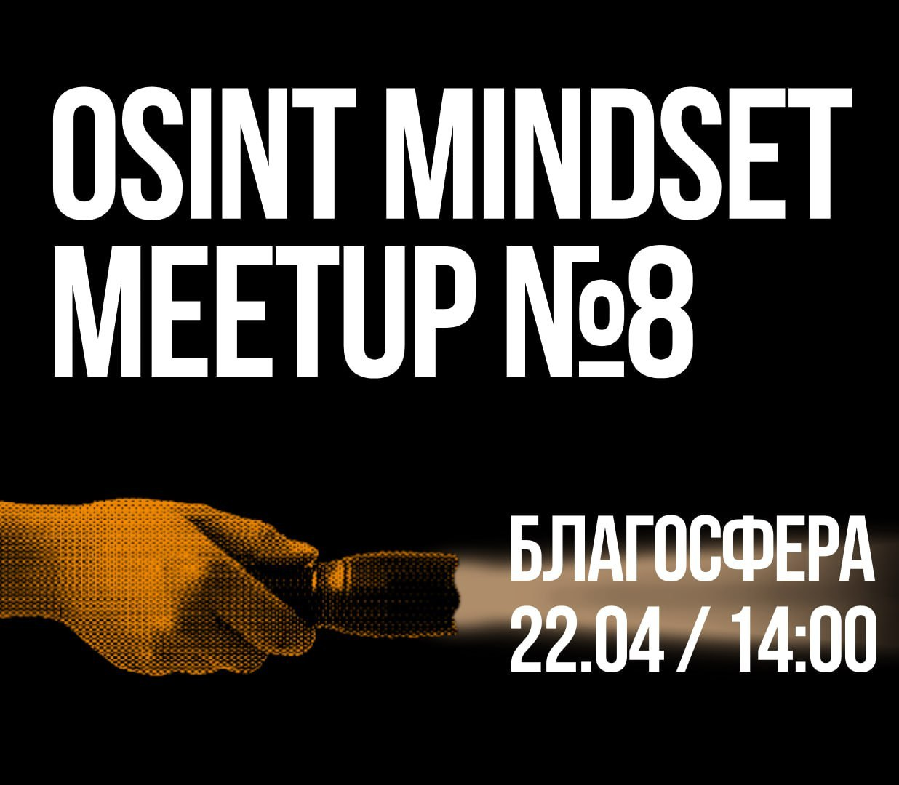

# Митап #8 | Москва

<figure><figcaption></figcaption></figure>

Покайтесь, ибо грядет OSINT Mindset meetup №8!

Вновь участники нашего коллектива врываются с мощнейшими докладами:

[**@dukera**](https://t.me/dukera\_ch) **— Теория распознавания лиц в OSINT: неизменные элементы внешности**

[**@emisare**](https://t.me/artemov\_security) **— Практика использования OSINT в корпоративной безопасности**

**@Akvagon — Манипуляции на основе открытых данных, или Как работает магия экстрасенсов**

Приходите, будет насыщенно и интересно, как всегда!

Ждем всех 22 апреля, в 14:00 по адресу [Благосфера](https://blagosfera.ru/kontakty/), м. Динамо, 1-й Боткинский проезд, д. 7c1.

Для тех, кто на своей бричке, есть парковка. Пишите @nymaxxx
