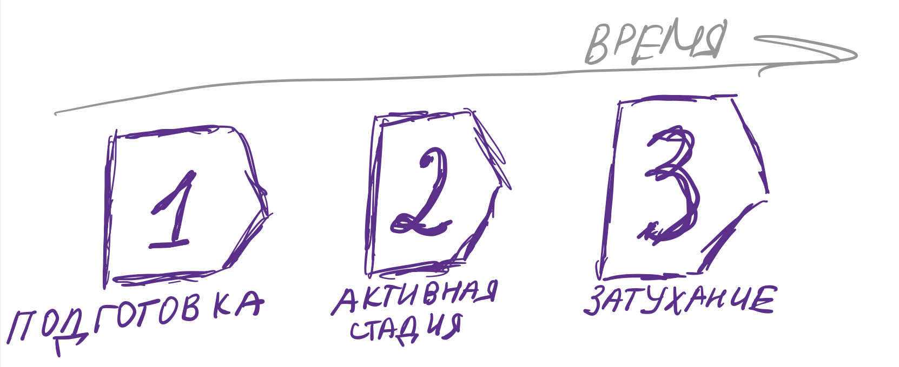

# Расследователи инцидентов и все-все-все: кратко про инфобез

Итак, дорогие мои шерлоки, если вы внимательно читаете каналы по теме OSINT, то точно натыкались на тему инфобеза. Пришло время разобраться, что же это за такой зверь, и причем тут OSINT.\
Дабы не запутать вас в терминологии, представим небольшой словарик.

> **Инфобез** – это область знаний и умений, направленных на защиту различных объектов от атак технологичного спектра. А **OSINT** – это, как раз, одно из таких умений.

Получается, что все нижеследующие представления о скрещивании инфобеза и OSINT’а, строго говоря, не валидны.

<figure><figcaption></figcaption></figure>

Также здесь стоит упомянуть одну важную деталь. Линия атаки разделяет инфобез на две равные части, offensive и defensive, red и blue, наступательную и оборонительную. Несмотря на разницу названий, все эти вещи про одно. От атак можно защищаться двумя основными способами: моделируя атаку до ее наступления и борясь с происходящими живыми атаками. В последнее деление тут также включим проактивную борьбу или Threat Intelligence. Данная статья направлена на иллюстрирование именно второй - blue - части инфобеза. DRP, antipiracy и прочее аналитическое пока отставим в сторонку.

<figure><figcaption></figcaption></figure>

## Жизненный цикл атаки

Чтобы ближе окунуться в тонкости инфобеза, давайте представим атаку. Ее жизненный цикл можно поделить на несколько стадий. Если говорить более возвышенно, то данные стадии представляют собой Cyber Killchain. Но мы с вами несколько упростим себе задачу и поделим атаку на более простые части, а именно:

1. Подготовка
2. Активная стадия
3. Затухание

Рассмотрим каждый этап подробнее.

### Подготовка

Для того, чтобы совершить какое-то киберпреступление злоумышленникам уже недостаточно просто с ноги вломиться в инфраструктуру компании. Им нужно провести некоторые подготовительные действия: зарегистрировать домены, купить нужные базы, написать вредонос и так далее. Набор действий всегда разный, но он будет, как правило, типизирован для конкретного вида киберпреступления. Более того, почти каждое из этих действий будет оставлять цифровые следы, которые, как вы догадываетесь, можно отследить. Зная о готовящейся атаки, специалисты могут предпринять верные действия для защиты вверенного им куска компании. Сие действо относительно недавно обрело устоявшееся название – Threat Intelligence, то бишь на русском названное киберразведкой (вам кто-то может сказать, что киберразведка - это что-то новое, неизведанное и не по открытым данным, но не верьте, они не ведают, что творят).

Таким образом, злоумышленники оставляют цифровые следы и по ним можно понять о готовящейся атаке. Там где цифровые следы, там и OSINT. С помощью открытых данных можно наблюдать за регистрирующимися доменами, изменениями в DNS, что пишут на форумах, что покупают и что продают. С помощью Threat Intalligence также можно зафиксировать уже произошедшую атаку, которую не смогли ранее обнаружить пострадавшие.\
\
Рассмотрим действие Threat Intelligence на примере атаки типа BEC. Для того, чтобы атака удалась, злоумышленники чаще всего регистрируют домены, схожие по написанию с целевой компанией. Далее настраивают почтовый сервер и отсылают поддельные письма. С помощью OSINT можно выловить фишинговый домен и обнаружить почтовый сервер уже на этапе подготовки атаки. Защитив слабые места инфраструктуры, специалисты по информационной безопасности готовы принимать бой.

### Активная фаза

В случае, если проактивно защититься целевому объекту не удалось, то атака развивается и набирает обороты. Здесь есть огромное количество нюансов, однако для чистоты повествования упростим все максимально сильно. Как уже было сказано ранее, заинтересованные отсылаются к концепции CyberKill Chain и далее.

Итак, перед нами атака, что необходимо сделать в первую очередь? Снизить потенциальный ущерб для целевого объекта. Это понятие имеет три основных аспекта: обнаружение, сдерживание и нейтрализация.

Обнаружение в текущих реалиях практически полностью ложится на плечи автоматизации. Положим в эту cтопку все современные технологии, обозначающиеся аббревиатурами: SIEM[^1], DLP[^2], MXDR[^3] и прочее, и прочее. Реже эту функцию выполняют работники CERT[^4] и SOC[^5]. Они также могут мониторить открытые источники информации, такие как форумы, блоги, социальные сети и Dark Web, для выявления ранних признаков угроз и атак на инфраструктуры компаний.

Если атаку удалось обнаружить и она происходит прямо на ваших глазах, то здесь необходимо предпринять верные меры по минимизации поверхности атаки и последующему сведению ее к нулю. Здесь в игру вступают специалисты по DFIR (Digital Forensics and Incident Response). OSINT в данном случае используется мало, так как работа в основном ведется с цифровыми носителя информации для извлечения улик и оперативного реагирования.

### Затухание

Когда самое горячее позади, наступает время для рефлексии. Данную стадию также можно назвать “разбор полетов”. Здесь определяется ущерб и происходит процесс “Lesson learned”. Опционально пострадавший объект изъявляет желание досконально разобраться в случившимся. Начинается процесс расследования инцидента информационной безопасности.

Такое желание может также появится еще на этапе развития атаки. В таком случае расследование может идти параллельно с реагированием и даже помогать ему. В качестве примера возьмем программу-шифровальщик. Часто бывает крайне важно вовремя начать реагирование и расследование, так как данные, полученные в результате расследования могут помочь в переговорах со злоумышленником.

<figure><figcaption></figcaption></figure>

## Подробнее про расследования

Стоит четко разграничивать работу Threat Intelligence и Cyber Investigator. Первые всегда действую проактивно, до инцидента, вторые - реактивно, после инцидента. В обязанности специалиста-расследователя входит:

* **Установление всех обстоятельств инцидента.** Это включает в себя анализ журналов системных событий, оригиналов писем, сетевой инфраструктуры, вредоносных файлов и других данных для определения сущности и характера инцидента.
* **Обогащение цифровых улик.** Поиск связанной информации по инциденту по открытым источникам с целью составить полную картину.
* **Составление рекомендаций.** Предложение мер по усилению защиты информационных систем и процессов, чтобы предотвратить подобные инциденты в будущем.
* **Документирование.** Составление отчетов о проведенных расследованиях, включая найденные уязвимости, причины инцидентов, предпринятые меры по их устранению и рекомендации для предотвращения подобных ситуаций в будущем.

Обязанности расследования в общем случае могут выполнять:

* специалисты DFIR;
* специалисты CERT и SOC;
* служба безопасности организации.

Перед таким специалистом могут ставится разные задачи. Это не всегда установление цифровых профилей профилей злоумышленников, участвующих в инциденте. Такие специалисты также устанавливать связи между различными объектами, например, относится ли к недавней атаки конкурирующая компания. Также расследователи могут быть вовлечены в процесс **eDiscovery**.

> **eDiscovery** (Electronic Discovery) – это процесс обнаружения, сбора, анализа и предоставления электронной информации в рамках правовых процессов и юридических расследований. Этот процесс широко используется в правовой сфере, особенно в случаях судебных процессов, расследований корпоративных нарушений и других ситуаций, требующих предоставления электронных доказательств.

Основные этапы eDiscovery включают:

1. **Идентификация и сохранение данных**: Определение и захват всех потенциально значимых электронных данных, которые могут иметь отношение к делу или расследованию. Это может включать в себя электронные сообщения, документы, базы данных, видео- и аудиофайлы и многое другое.
2. **Обработка и индексация данных**: Обработка собранных данных для устранения дубликатов, преобразования файлов в удобные для анализа форматы и создания поискового индекса для ускорения поиска и анализа.
3. **Поиск и анализ данных**: Поиск и изучение электронных данных с использованием специализированных инструментов и методов для выявления релевантной информации и доказательств.
4. **Оценка и рецензия данных**: Оценка найденной информации на предмет ее значимости и релевантности для дела или расследования, а также процесс рецензии для определения возможных привилегированных данных или конфиденциальной информации.
5. **Производство данных**: Предоставление найденной и отфильтрованной информации сторонам, участвующим в юридическом процессе, с соблюдением всех необходимых требований и правил.
6. **Мониторинг и обеспечение соответствия**: Осуществление контроля за процессом eDiscovery, чтобы гарантировать соблюдение сроков, требований законодательства и стандартов в области конфиденциальности и безопасности данных.

Большая часть работы расследователя лежит в плоскости открытых данных, поэтому OSINT для расследователя – неотъемлемая часть работы.

## Карьерный рост

Инфобез – штука популярная, быстро развивающаяся и довольно захватывающая. Поэтому, если вы прочитали до этого вопроса, то задались вопросом, как же начать карьеру в инфобезе. Ниже – пошаговое руководство.

**1. Освоение базовых технических знаний**

Прежде всего, вам необходимо обладать базовыми знаниями в области базового Computer Science. Это включает в себя понимание архитектуры компьютера, операционных системыи принципов работы компьютерных сетей. Это фундаментальные знания, которые помогут вам понять более сложные концепции и технологии в дальнейшем.

**Что делать?** Попробуйте пройти классический курс по Computer Science, например, на Coursera, а также решайте CTF-задачи. Можете начать в платформы rootme.

**2. Выбор специализации**

После того как вы освоили базовые концепции, пришло время определиться с направлением вашей карьеры в области информационной безопасности. Существует множество вариантов, таких как разработка, реверс-инжиниринг, Digital Risk Protection (DRP) и многое другое уже упомянутое. Вам стоит попробовать каждое направление и определить, что вам наиболее интересно и в чем вы чувствуете себя наиболее уверенно.

**Что делать?** Пробовать. Изучите вакансии разных направлений. Почитайте статьи по той или иной области. Практикуйтесь.

**3. Изучение OSINT**

Если вы поняли, что в вашей профессии без OSINT никак, то пришло время его изучать. “Неужели только сейчас?!” – спросите вы. Да, именно так. Если вы прям нуб в компьютерных технологиях, вам, наверное, сложно будет изучать OSINT достаточно глубоко. Если вы хотите понять какой-то метод OSINT (в особенности сетевой), вы должны понимать, как это работает. Соответственно, база все равно вам понадобится. Поэтому после нее вы спокойно можете изучать OSINT, если он используется в том направлении, которое вам понравилось.

**Что делать?** Следуйте статье туть: [https://gitbook.osint-mindset.com/index/guides/kak-nachat-put-v-osint](https://gitbook.osint-mindset.com/index/guides/kak-nachat-put-v-osint)

**4. Междисциплинарный подход**

После того как вы освоили базовые и продвинутые технические навыки, наступает время принять вызов и продвинуться по карьерной лестнице. Будь то погружение в основы OSINT или изучение более сложных методов и технологий в вашей области специализации, не переставайте развиваться и учиться. Если вам кажется, что вы уже все выучили, то скорее всего это не так. Современные технологии – вещь постоянно меняющаяся. Новые методы OSINT появляются и исчезают, поэтому крайне важно держать руку на пульсе. Более того, старайтесь захватить как можно больше различных дисциплин и стыков специальностей, так как в таком случае вы станете крайне ценным специалистом.\
\
**Что делать?** Обратите внимание на смежные области. Можете ли вы найти пересечения между выбранной специальностью и ими? Постарайтесь поверхностно их изучить.

**5. Постоянная практика**

Стать профессионалом в области информационной безопасности требует не только технических знаний, но и практического опыта. Продолжайте учиться, углублять свои знания и применять их на практике. Создание портфолио с кейсами из реальной практики поможет вам продемонстрировать свои навыки и достичь профессионального уровня в своей области.

**Что делать?** Составлять портфолио из успешных и неуспешных кейсов, собирать опыт. При необходимости кейсы можно обезличивать. Специалист без портфолио = специалист без опыта.

**6. Созидание**

Наконец, не забывайте о значимости инноваций и постоянного развития. Стремитесь создавать новые методологии и подходы к решению проблем в области информационной безопасности. Создание чего-то нового в области – верный шаг к профессионализму.

**Что делать?** Улучшать открытые методологии и инструменты. Например, инструменты с [GitHub OSINT mindset](https://github.com/OSINT-mindset), [SOWEL](https://publish.obsidian.md/soxoj-sowel/about), [GEWEL](https://publish.obsidian.md/dukera-gewel/about).

## Вместо заключения

> _— Черт возьми! — воскликнул инспектор, — как вам удалось это найти?_
>
> — _**Я нашел**_, _**потому что искал**_.

_**Артур**_ _**Конан Дойл**_

<figure><figcaption></figcaption></figure>

[^1]: Security information and event management

[^2]: Data Leak Prevention

[^3]: Managed Extended Detection and Response

[^4]: Computer Emergency Response Team

[^5]: Security Operations Center
