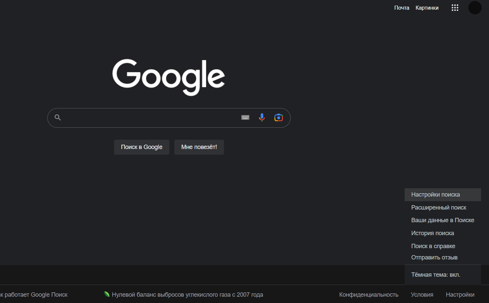
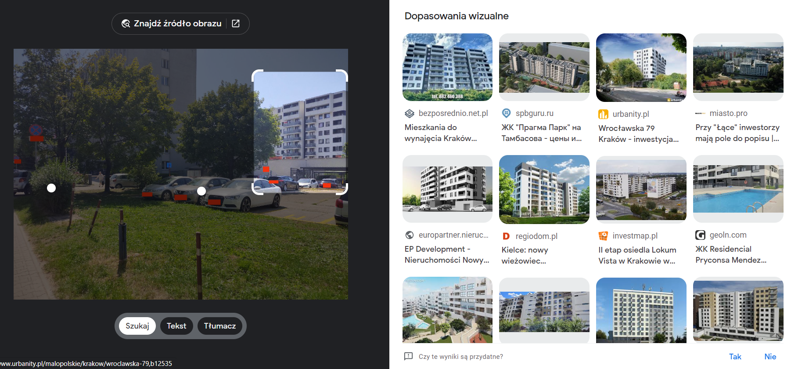
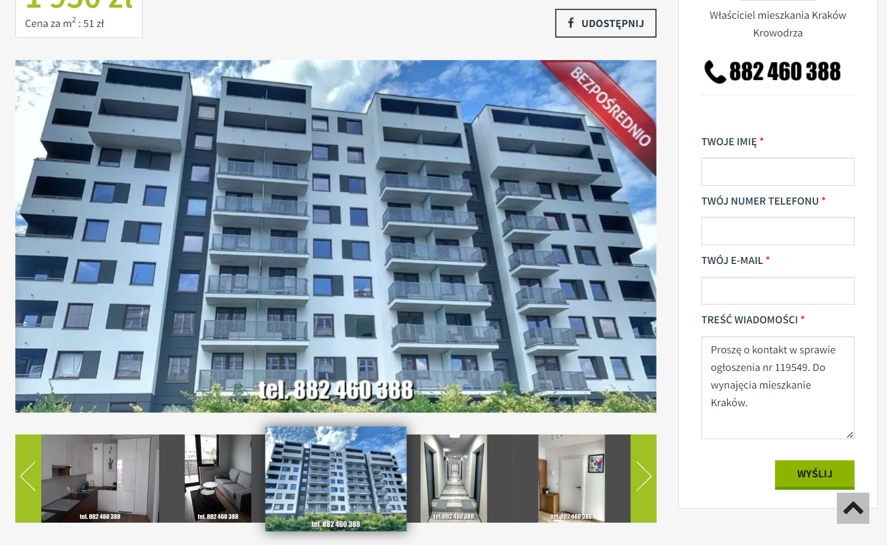

# 👣 Введение в OSINT-расследования

## Реверсивный поиск по изображению.

Этот метод является очень распространенным в решении GEOINT, OSINT задач. Если место на картинке является достаточно популярным, то он со 100% вероятностью поможет найти его.

### Что же такое реверсивный поиск по изображению?

Реверсивный поиск по изображению - это способ найти источник, автора,  распознать язык или другую информацию о картинке, загрузив ее в поисковую систему.

И так, что это такое мы разобрались. Давайте посмотрим какие есть поисковики, с которыми можно искать по картинке.

Существует три основные поисковика.

#### 1. Google Lens

<figure><figcaption></figcaption></figure>

Это пожалуй является самым популярным и универсальным поиском по изображению.

Google Lens умеет:

1. Он может предоставлять релевантную информацию об изображении, такую как здания, предметы, текст, штрих-коды, достопримечательности, продукты, и т.д.
2. Он может переводить текст с более чем 100 языков
3. Он может помочь вам найти похожую одежду, мебель или домашний декор на основе изображения.

Из минусов я могу отметить, что он плохо работает с лицами.

### Базовый поиск по изображению.

И так, если вы никогда до этого не пользовались, то вот простая задача, с которой можно попрактиковаться.

<figure><figcaption></figcaption></figure>

Эта задача GEOINT #19. Дана фотография, нужно найти место.

1\. Идем на google.com и жмем на иконку фотоаппарата.

<figure><figcaption></figcaption></figure>

2\. Загружаем нашу фотографию (Можно перебросить с компьютера, а можно просто скопировать картинку и вставить с помощью ctrl+v)

Итак мы получили результат, так как место достаточно популярное, то место выдало сразу - Kadıköy İnciburnu Feneri.

<figure><figcaption></figcaption></figure>

Теперь вводим это место в Google Maps, находим точное место, где стоял фотограф и получаем ответ - 40.9922934 29.0146183.

<figure><figcaption></figcaption></figure>

Так, ладно базово пользоваться Google Lens мы разобрались, давайте перейдем к следующему таску и научимся еще одной вещи.

### Ненужные элементы на изображении (Шум).

Чтобы было лучше понятно, что это такое давайте взглянем на эту картинку.

<figure><figcaption></figcaption></figure>

Нужно найти место. Так, давайте загрузим это изображение в Google Lens. Выделяем здание в окне и вот такие результаты мы получаем:

<figure><figcaption></figcaption></figure>

Мы хотели здание вдали, а получили окна. В данном случае окно на фото - это шум (noise).

Чтобы получить желанный результат, нам нужно от этого шума избавиться. Можно использовать следующие методы:

1. Сайт cleanup.pictures. Самый простой способ. Просто выделяем ненужный объект и он исчезает.
2. Photoshop. Можно использовать spot healing brush tool или штамп. Иногда получается очень аккуратно стереть объект, если умеешь пользоваться фотошопом.
3. Нейросети. Обычно я использую нейросети, чтобы дополнить изображение, но можно их использовать, чтобы стереть ненужный объект. (Например DALL-E 2)

Давайте воспользуемся первым и самым простым способом.

Переходим на сайт cleanup.pictures.

<figure><figcaption></figcaption></figure>

Загружаем фотографию и выделяем окно.

<figure><figcaption></figcaption></figure>

Получаем результат:

<figure><figcaption></figcaption></figure>

Теперь этого достаточно, чтобы найти это здание. Все также загружаем в Google Lens и выделяем здание и получаем, то что мы хотели.

<figure><figcaption></figcaption></figure>

Итак, мы знаем теперь здание вдали - это Латвийская Национальная библиотека, осталось найти здание, которое стоит напротив.

А вот и оно : The Wellton Riverside Spa Hotel in Riga

<figure><figcaption></figcaption></figure>

Теперь если посмотреть информацию про conference rooms на сайте этого отеля, то находим похожую комнату.

<figure><figcaption></figcaption></figure>

Ладно, теперь пытаемся найти точные координаты, откуда было сделано фото и получаем ответ: 56.945074540, 24.108067195.

Хорошо, теперь давайте посмотрим на еще одну важную вещь в поиске изображений.

### Язык

Иногда хочется получать результаты только одной страны, но к сожалению выдает результаты из разных стран.

Чтобы избавиться от такой проблемы, нужно поменять язык в поиске Google. Итак давайте посмотрим на примере этой фотографии.

<figure><figcaption></figcaption></figure>

Дана фотография, нужно найти место.

Итак, если обратим внимание, то увидим польский флаг на здании вдали, поэтому предполагаем, что это Польша.

Давайте попробуем загрузить это изображение в Google Lens и выделить здание вдали. У меня стоит русский язык, поэтому получаем разные результаты. Это Латвия, Россия, Чехия, Польша. Но мы же хотим, чтобы отображались результаты только с Польши. Для этого мы как раз и сменим язык в Google.

Для этого переходим на главную страницу Google. Нажимаем настройки -> настройки поиска.

<figure><figcaption></figcaption></figure>

Далее нажимаем языки и выбираем польский.

<figure><figcaption></figcaption></figure>

Теперь загружаем фото в Google Lens и получаем в основном польские результаты. Среди них есть и наша застройка.

<figure><figcaption></figcaption></figure>

Переходим по первой ссылке, находим то же объявление и смотрим адрес.

<figure><figcaption></figcaption></figure>

Итак, на сайте написано, что это Город Краков, улица Wrocławska. Вводим это в Google Maps и ищем наше здание.

Спустя несколько минут прогуливание по улице, находим место.

<figure><figcaption></figcaption></figure>

Координаты: 50.08063721, 19.9214986570.

### Распознавание языка

Так, теперь давайте рассмотрим еще одну фичу - это распознавание языка. Это бывает полезно, когда на фото иероглифы, которые просто так на клавиатуре не набрать. Давайте рассмотрим реальный кейс.

<figure><figcaption></figcaption></figure>

Мы видим на столбе иероглифы. Понять и написать на клавиатуре мы их не можем. Нам поможет Google Lens.

Загружаем изображение и выделяем иероглифы.

<figure><figcaption></figcaption></figure>

К сожалению не определился первый иероглиф, потому что он немного закрыт черной точкой. Ничего страшного, можем дорисовать иероглиф в пэинте, фотошопе, ну или на сайте photopea.

<figure><figcaption></figcaption></figure>

Иногда приходится дорисовывать некоторые элементы изображения, чтобы гугл их начал распознавать, как с этим иероглифом.

Загружаем снова в Google Lens. Ура! Все иероглифы определились.

<figure><figcaption></figcaption></figure>

Это больница в Японии. Хорошо, вводим адрес этой больницы в Google Maps и смотрим дальше.

<figure><figcaption></figcaption></figure>

На фото можно увидеть цифру 20 на асфальте.

<figure><figcaption></figcaption></figure>

Также мы видим, что стрелка указывает на больницу сзади, поэтому скорее всего это вот эта дорога.

<figure><figcaption></figcaption></figure>

Смотрим эту дорогу на наличие цифры 20 и находим вот это.

<figure><figcaption></figcaption></figure>

Переключаемся на Street View и убеждаемся, что это наше место.

<figure><figcaption></figcaption></figure>

Это оно!

**Ответ: 35.71140247380368, 139.51662659726136.**

### Нейросети

Иногда, у нас имеется только часть фото или фото с искажениями. В этом случае можно дополнить или изменить фотографию с помощью нейросетей.

В основном используются две нейросети - DALLE-E 2 и Stable Diffusion.

Я буду показывать на DALLE-E 2.

Итак, давайте посмотрим на реальную задачу.

<figure><figcaption></figcaption></figure>

У нас есть это изображение. Нужно найти блог, на котором плавает это существо.

Мы видим, что у существа нет головы, изображение искажено. Google Lense нужных результатов не выдаст.

<figure><figcaption></figcaption></figure>

Поэтому нам надо обхитрить гугл и дать понять, что это за животное и что мы вообще хотим искать. Для этого воспользуемся нейросетью dalle-e 2, чтобы дорисовать голову.

Для этого нам понадобится аккаунт OpenAI и VPN (Для России).

Хорошо, заходим на сайт нейросети и нажимаем upload an image.

<figure><figcaption></figcaption></figure>

Выбираем наше изображение и нажимаем skip cropping.

<figure><figcaption></figcaption></figure>

Растягиваем изображение ( Я растянул до 642x1200)

<figure><figcaption></figcaption></figure>

Нажимаем на галочку и стираем область, где мы хотим дорисовать голову ластиком. В поле для промта пишем rat.

Дальше выбираете понравившийся результат и скачиваете картинку.

<figure><figcaption></figcaption></figure>

Нейросеть дорисовала голову, теперь это можно загружать в Google Lens и получаем наш результат.

<figure><figcaption></figcaption></figure>

Продолжение решения можете посмотреть: [https://telegra.ph/Reshenie-OSINT-24-01-27](https://www.google.com/url?q=https://telegra.ph/Reshenie-OSINT-24-01-27\&sa=D\&source=editors\&ust=1679408059838999\&usg=AOvVaw39JTM\_p\_t4CaqE7qECy5sb)

### Поиск источника

Допустим у нас есть это изображение.

.png>)

Мы хотим найти сайты, где встречается именно это изображение. Для этого нужно загрузить это фото в Google Lens и нажать на Найти источник изображения.

.png>)

Теперь мы можем видеть на каких сайтах это изображение встречалось. Это один из самых важных моментов.

<figure><figcaption></figcaption></figure>

### Хитрости

Иногда встречаются изображения, которые линза без предварительной обработки не распознает.

Давайте взглянем на этот таск.

<figure><figcaption></figcaption></figure>

Нужно по спутниковому снимку найти город. Если мы загрузим это в Google Lens, то нужных результатов мы не увидим.

<figure><figcaption></figcaption></figure>

Выдало только похожие. А теперь давайте акцентируем внимание на речке, все так она очень уникальная. Для этого в пэинте или фотошопе обводим ее жирно и светлым цветом. У меня получилось как то так.

<figure><figcaption></figcaption></figure>

Теперь это загружаем в линзу и смотрим результаты.

.png>)

Немного полистав, находим изображение с похожей речкой. Это город Берн, Швейцария.

Давайте упомянем другие поисковики.

### Яндекс Картинки

.png>)

Еще один поисковик с реверсивным поиском - это Яндекс. Он работает хорошо с СНГ регионами, а также хорош для поиска лиц. Часто бывает, что выдает результаты, с которым не получилось достичь с Google Lens.

На этой картинке показано сравнение разных поисковиков на поиск по лицу:

<figure><figcaption></figcaption></figure>

Видно, что Google и Bing не очень справились со своей задачей.

### Bing

### .png>)

В целом к нему довольно редко обращаюсь, но иногда он выручает, поэтому стоит его тоже упомянуть.
